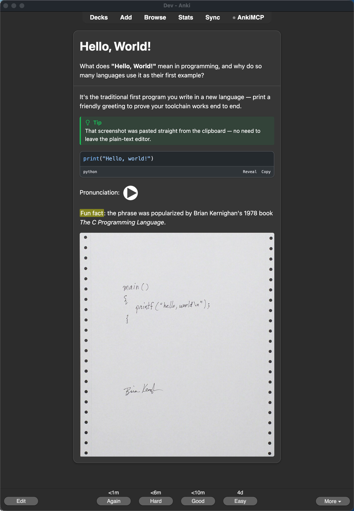

# Markdown Pro

> Anki add-on for Markdown notes with syntax highlighting powered by [Shiki](https://shiki.style)

Write flashcards in Markdown with full [syntax highlighting](docs.md#code-blocks). Pick from 300+ languages and 60+ themes — only your selections are downloaded and synced. Supports light and dark mode across desktop, mobile, and AnkiWeb.



> [!NOTE]
> Requires [Anki](https://apps.ankiweb.net/) 25.x or later. Go to `Tools → Add-ons → Get Add-ons` and install from a release `.ankiaddon` file (AnkiWeb id pending).
> See the [documentation](docs.md) for all supported features.

- **Syntax highlighting** with 300+ languages and 60+ themes, only your selections are downloaded and synced
- **Advanced code annotations** including line highlighting, word highlighting, focus mode, and error/warning markers
- **Full Markdown** with bold, italic, lists, blockquotes, tables, images, alerts, and more
- **Paste images & media** directly into the editor — files land in collection.media, references are inserted at the cursor
- **Reversed cards** via the `(and reversed)` / `(optional reversed)` note types
- **Plays nice with other add-ons** — HyperTTS/AwesomeTTS template edits and `[sound:]` audio survive rendering; only the managed template block is ever rewritten
- **Clean card design** with polished light/dark styling that matches Anki's native UI
- **Settings panel** to dynamically pick languages and themes
- **Cross-platform** works on desktop, AnkiDroid, AnkiMobile, and AnkiWeb
- **[AI agent skill](#ai-agent-skill)** built-in skill that lets AI agents create markdown flashcards via [AnkiConnect](https://foosoft.net/projects/anki-connect/)


## What's new in this build

- **Paste/drag images, audio, and video** directly into the plain-text editor
- **Reversed card note types** — `Markdown Pro (and reversed)` and `Markdown Pro (optional reversed)`
- **Compatible with template-editing add-ons** like HyperTTS and AwesomeTTS — card templates use a managed block, so anything an add-on adds outside it survives on the next Anki restart
- `[sound:]` **audio and native replay buttons render correctly** instead of being stripped by the sanitizer
- **Renamed throughout** (package, note types, media files, CSS classes) so it never collides with an existing `Anki Markdown` install — you can run both side by side, or migrate notes over from the Tools menu

See [docs.md](docs.md) for full usage details on all of the above.

## Usage

After installing the add-on:

1. **Create a new note** using the **Markdown Pro** note type (Add → Note Type dropdown → Markdown Pro)
2. **Write your question** in the Front field using markdown
3. **Write your answer** in the Back field using markdown
4. The markdown will be automatically rendered with syntax highlighting when you review the card

> [!NOTE]
> See the [documentation](docs.md) for all supported markdown features including code blocks, line highlighting, alerts, and more.


## AI Agent Skill

Markdown is a perfect format for AI-generated content, and this add-on leans into that. It ships with a companion skill that lets AI coding agents (Claude Code, Codex, etc.) create and manage markdown flashcards directly from your editor via [AnkiConnect](https://foosoft.net/projects/anki-connect/). The add-on renders the markdown, the skill creates it.

**Prerequisites:** Anki desktop running with [AnkiConnect](https://foosoft.net/projects/anki-connect/) installed.

Install:

```bash
npx skills add hereAlexTeng/markdown-pro -s anki
```


## Settings

Open the settings panel from `Tools → Add-ons → Markdown Pro → Config`.

- **Languages** — pick which languages are available for syntax highlighting. New languages are downloaded on save. Use the filter and "Selected only" toggle to manage your list.
- **Theme** — choose separate Shiki themes for light and dark mode.
- **UI** — toggle cardless mode for a borderless card design.


## Development

See [development.md](development.md) for build, test, and release instructions.

## Fork Notice

This project is a fork of [terkelg/anki-markdown](https://github.com/terkelg/anki-markdown) by [Terkel Gjervig](https://github.com/terkelg), used under the [MIT License](license). All credit for the original architecture, renderer, and syntax-highlighting engine goes to the upstream project — go star it.

This fork is renamed throughout (package, note types, media files, CSS classes) so it can be installed **alongside** the original without conflicts, and adds paste-to-embed media, reversed card note types, and compatibility fixes so add-ons like HyperTTS keep working.